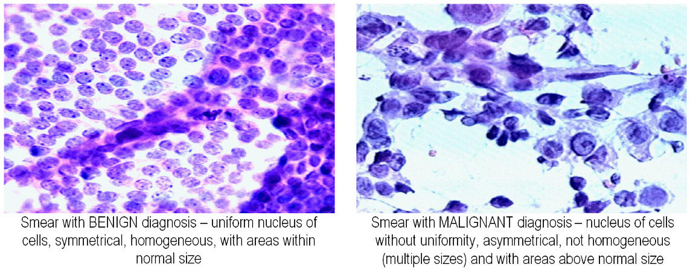

---
jupytext:
  text_representation:
    extension: .md
    format_name: myst
    format_version: 0.13
    jupytext_version: 1.16.7
kernelspec:
  display_name: Python 3
  language: python
  name: python3
---

# Vectors and the Spaces they live in

In this chapter we present important classes of spaces in which our data will live and our operations will take place: 
vector spaces, metric spaces, normed spaces, and inner product spaces.
Generally speaking, these are defined in such a way as to capture one or more important properties of Euclidean space but in a more general way.


## Using Vectors to diagnose breast cancer
In machine leaerning, we will be working with data that is represented as vectors in a vector space.
To make this more concrete, let's start by looking at some data from the Wisconsin Diagnostic Breast Cancer (WDBC, 1993) data set:

```{code-cell} ipython3
:tags: [hide-input]
### Some imports
# All packages are included in the Anaconda python distribution and integral part of a machine learning Python environment).
import numpy as np               # efficient matrix-vector operations
import numpy.linalg as la        # linear algebra (solvers etc.)
import pandas as pd              # data processing, CSV file I/O (e.g. pd.read_csv)
import seaborn as sns            # data visualization  
sns.set_style("whitegrid")        # set the figure default style
sns.set_context("talk")
sns.set(font_scale=1.5)          # bigger fonts in images
import matplotlib.pyplot as plt  # basic plotting
from sklearn.model_selection import train_test_split

# some not so standard imports:
import sys
sys.path.append("../../datasets/uci_breast_cancer")   # add dataset directory to path, such that we find the scripts relating to the dataset
import plotting_util as util     # useful plotting tools for teaching (see ../datasets/uci_breast_cancer/

# fetch dataset from Kaggle
import kagglehub
path = kagglehub.dataset_download("uciml/breast-cancer-wisconsin-data/versions/2")
df = pd.read_csv(path+"/data.csv")

# data (as pandas dataframes) 
X = df[["concavity_mean", "texture_mean"]]
y = df["diagnosis"]

# split the data into a training set (70%) and a test set (30%)
X_train, X_test, y_train, y_test = train_test_split(X, y, test_size=0.3, random_state=1)

# print out some basic information about the training data
print (y_train.shape)
print (y_train.unique())
print ("Benign samples    'B': {:}".format((y=='B').sum()))
print ("Malignant samples 'M': {:}".format((y=='M').sum()))
```
The data consists of two numerical features that describe the distribution of cells in breast tissue samples that are visible under the microscope together with the diagnosis wether the tissue is *benign* (*B*) or *malignant* (*M*). 



The two features represent the average *concavity* and *texture* of the nuclei and have been determined from image processing techniques [Street et al, 1992].
In machine learning, we typically represent the features that belong to a sample with index $n\in \{1,2,\dots, N\}$ as a vector $\mathbf{x}_n$ that lives in an appropriate vector space $V$.
In this example, the vector space is $\mathbb{R}^2$, the 2-dimensional Euclidean space.

```{code-cell} ipython3
:tags: [hide-input]
# plot the data
f, ax = plt.subplots(figsize=(7, 7))
ax = util.scatter_plot_kde2(X_train,y_train)
plt.ylim([8,39.9])
plt.xlim([-0.01,0.45])
```

When we look at the plot, we observe, that the location of a feature vector $\mathbf{x}_n$ in the 2-dimensional space provides some information about the diagnosis.

Feature vectors in the bottom-left corner of the plot are more likely to be benign, while feature vectors in the top-right corner are more likely to be malignant.
Thus, given the information encoded in these **feature vectors**, we could determine the likely diagnosis, i.e., to **classify** the samples as malignant or benign. 

+++

### Binary Classificaiton of breast cancer

+++

**Classification** refers to the task of predicting a **class label** $y$, *i.e.*, the diagnosis, from a **feature vector** $\bf{x}$.
For the case, where $y$ can take one of two values, we speak of binary classification.

In machine learning, we assume that we are given pairs of $(\mathbf{x}, y)$, the so-called **training data**, we would like to **train** a function $f(\mathbf{x})$ that predicts the value of $y$.

For the task at hand, this means that we use the image features to determine wether a patient likely has a benign or malignant diagnosis.
Then given a new sample for which we don't know the diagnosis, we can predict the diagnosis based on what we have learned from from the training data.
We call such a new sample the **test data**.

+++
In order to dive deeper into the question on how we find such a classification function, we first need to develop out toolset and have a deeper look into vectors, their properties, the operations that we can perform on them and the spaces they live in.

### References
[Street et al, 1992] N. Street, W. Wolberg, O.L. Mangasarian:  Nuclear Feature Extraction For Breast Tumor Diagnosis. IS&T/SPIE 1993.

```{tableofcontents}
```