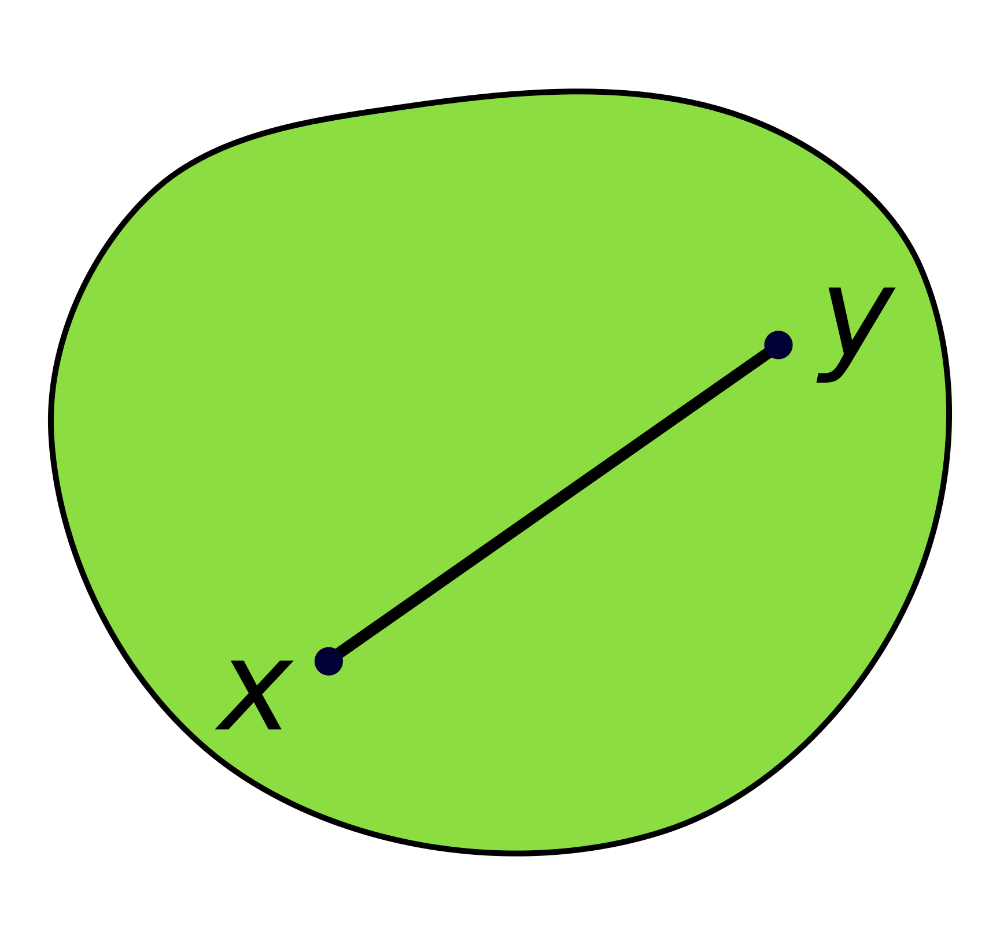
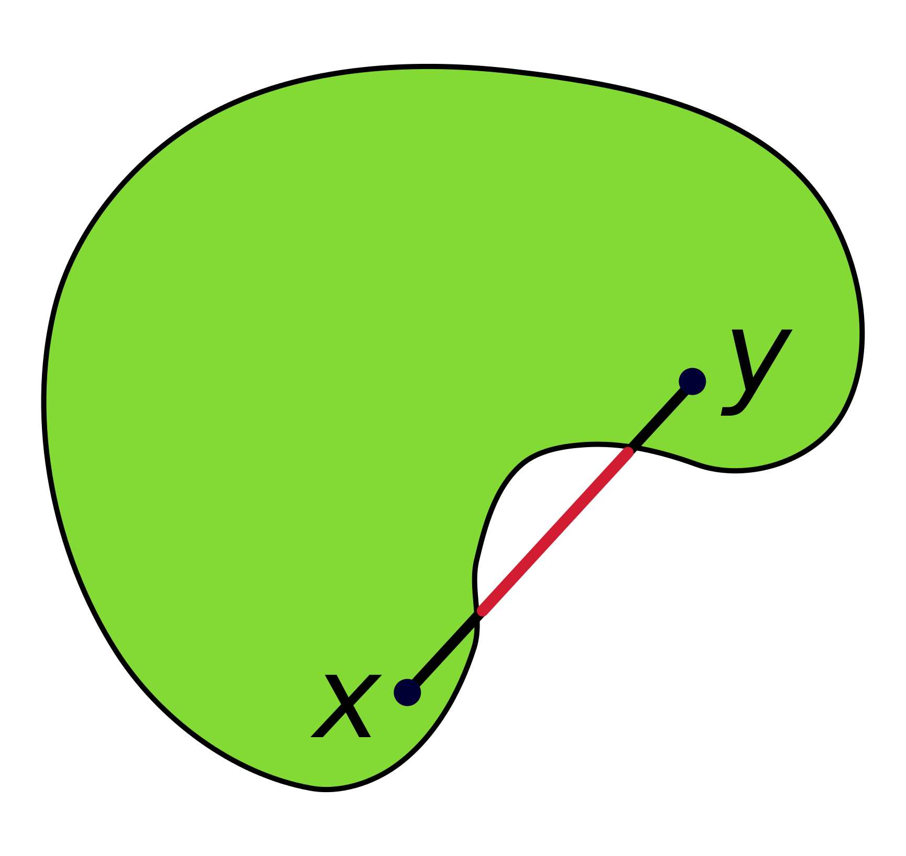
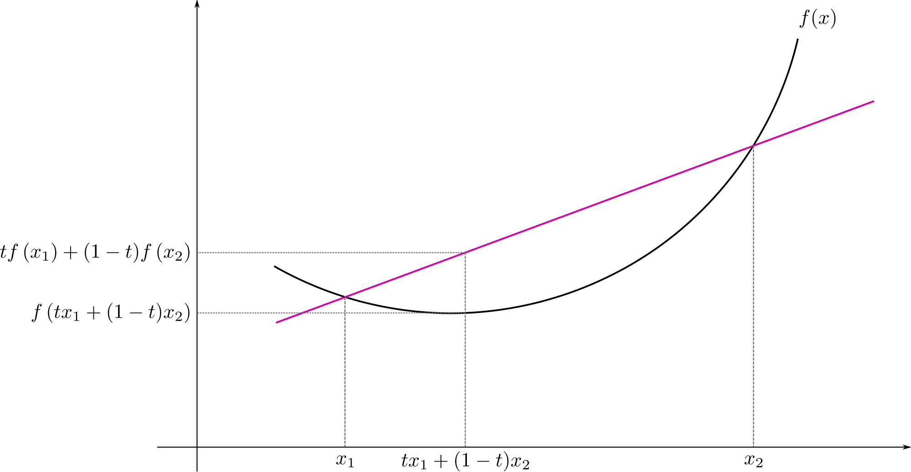

## Convexity

**Convexity** is a term that pertains to both sets and functions. For
functions, there are different degrees of convexity, and how convex a
function is tells us a lot about its minima: do they exist, are they
unique, how quickly can we find them using optimization algorithms, etc.
In this section, we present basic results regarding convexity, strict
convexity, and strong convexity.

### Convex sets
 ::: center

A convex set
:::

 ::: center

A non-convex set
:::

A set $\mathcal{X} \subseteq \mathbb{R}^d$ is **convex** if

$$t\mathbf{x} + (1-t)\mathbf{y} \in \mathcal{X}$$

for all
$\mathbf{x}, \mathbf{y} \in \mathcal{X}$ and all $t \in [0,1]$.

Geometrically, this means that all the points on the line segment
between any two points in $\mathcal{X}$ are also in $\mathcal{X}$. See
Figure [1](#fig:convexset){reference-type="ref"
reference="fig:convexset"} for a visual.

Why do we care whether or not a set is convex? We will see later that
the nature of minima can depend greatly on whether or not the feasible
set is convex. Undesirable pathological results can occur when we allow
the feasible set to be arbitrary, so for proofs we will need to assume
that it is convex. Fortunately, we often want to minimize over all of
$\mathbb{R}^d$, which is easily seen to be a convex set.

### Basics of convex functions

In the remainder of this section, assume
$f : \mathbb{R}^d \to \mathbb{R}$ unless otherwise noted. We'll start
with the definitions and then give some results.

A function $f$ is **convex** if

$$f(t\mathbf{x} + (1-t)\mathbf{y}) \leq t f(\mathbf{x}) + (1-t)f(\mathbf{y})$$

for all $\mathbf{x}, \mathbf{y} \in \operatorname{dom} f$ and all $t \in [0,1]$.

If the inequality holds strictly (i.e. $<$ rather than $\leq$) for all
$t \in (0,1)$ and $\mathbf{x} \neq \mathbf{y}$, then we say that $f$ is
**strictly convex**.

A function $f$ is **strongly convex with parameter $m$** (or
**$m$-strongly convex**) if the function

$$\mathbf{x} \mapsto f(\mathbf{x}) - \frac{m}{2}\|\mathbf{x}\|_2^2$$ 

is
convex.

These conditions are given in increasing order of strength; strong
convexity implies strict convexity which implies convexity.

 ::: center

What convex functions look like
:::

Geometrically, convexity means that the line segment between two points
on the graph of $f$ lies on or above the graph itself. See Figure
[2](#fig:convexfunction){reference-type="ref"
reference="fig:convexfunction"} for a visual.

Strict convexity means that the graph of $f$ lies strictly above the
line segment, except at the segment endpoints. (So actually the function
in the figure appears to be strictly convex.)

### Consequences of convexity

Why do we care if a function is (strictly/strongly) convex?

Basically, our various notions of convexity have implications about the
nature of minima. It should not be surprising that the stronger
conditions tell us more about the minima.

*Proposition.*
Let $\mathcal{X}$ be a convex set. If $f$ is convex, then any local
minimum of $f$ in $\mathcal{X}$ is also a global minimum.

*Proof.* Suppose $f$ is convex, and let $\mathbf{x}^*$ be a local
minimum of $f$ in $\mathcal{X}$. Then for some neighborhood
$N \subseteq \mathcal{X}$ about $\mathbf{x}^*$, we have
$f(\mathbf{x}) \geq f(\mathbf{x}^*)$ for all $\mathbf{x} \in N$. Suppose
towards a contradiction that there exists
$\tilde{\mathbf{x}} \in \mathcal{X}$ such that
$f(\tilde{\mathbf{x}}) < f(\mathbf{x}^*)$.

Consider the line segment
$\mathbf{x}(t) = t\mathbf{x}^* + (1-t)\tilde{\mathbf{x}}, ~ t \in [0,1]$,
noting that $\mathbf{x}(t) \in \mathcal{X}$ by the convexity of
$\mathcal{X}$. Then by the convexity of $f$,

$$f(\mathbf{x}(t)) \leq tf(\mathbf{x}^*) + (1-t)f(\tilde{\mathbf{x}}) < tf(\mathbf{x}^*) + (1-t)f(\mathbf{x}^*) = f(\mathbf{x}^*)$$

for all $t \in (0,1)$.

We can pick $t$ to be sufficiently close to $1$ that
$\mathbf{x}(t) \in N$; then $f(\mathbf{x}(t)) \geq f(\mathbf{x}^*)$ by
the definition of $N$, but $f(\mathbf{x}(t)) < f(\mathbf{x}^*)$ by the
above inequality, a contradiction.

It follows that $f(\mathbf{x}^*) \leq f(\mathbf{x})$ for all
$\mathbf{x} \in \mathcal{X}$, so $\mathbf{x}^*$ is a global minimum of
$f$ in $\mathcal{X}$. ◻

*Proposition.*
Let $\mathcal{X}$ be a convex set. If $f$ is strictly convex, then there
exists at most one local minimum of $f$ in $\mathcal{X}$. Consequently,
if it exists it is the unique global minimum of $f$ in $\mathcal{X}$.

*Proof.* The second sentence follows from the first, so all we must show
is that if a local minimum exists in $\mathcal{X}$ then it is unique.

Suppose $\mathbf{x}^*$ is a local minimum of $f$ in $\mathcal{X}$, and
suppose towards a contradiction that there exists a local minimum
$\tilde{\mathbf{x}} \in \mathcal{X}$ such that
$\tilde{\mathbf{x}} \neq \mathbf{x}^*$.

Since $f$ is strictly convex, it is convex, so $\mathbf{x}^*$ and
$\tilde{\mathbf{x}}$ are both global minima of $f$ in $\mathcal{X}$ by
the previous result. Hence $f(\mathbf{x}^*) = f(\tilde{\mathbf{x}})$.
Consider the line segment
$\mathbf{x}(t) = t\mathbf{x}^* + (1-t)\tilde{\mathbf{x}}, ~ t \in [0,1]$,
which again must lie entirely in $\mathcal{X}$. By the strict convexity
of $f$,

$$f(\mathbf{x}(t)) < tf(\mathbf{x}^*) + (1-t)f(\tilde{\mathbf{x}}) = tf(\mathbf{x}^*) + (1-t)f(\mathbf{x}^*) = f(\mathbf{x}^*)$$

for all $t \in (0,1)$. But this contradicts the fact that $\mathbf{x}^*$
is a global minimum. Therefore if $\tilde{\mathbf{x}}$ is a local
minimum of $f$ in $\mathcal{X}$, then
$\tilde{\mathbf{x}} = \mathbf{x}^*$, so $\mathbf{x}^*$ is the unique
minimum in $\mathcal{X}$. ◻

It is worthwhile to examine how the feasible set affects the
optimization problem. We will see why the assumption that $\mathcal{X}$
is convex is needed in the results above.

Consider the function $f(x) = x^2$, which is a strictly convex function.
The unique global minimum of this function in $\mathbb{R}$ is $x = 0$.
But let's see what happens when we change the feasible set
$\mathcal{X}$.

(i) $\mathcal{X} = \{1\}$: This set is actually convex, so we still have
    a unique global minimum. But it is not the same as the unconstrained
    minimum!

(ii) $\mathcal{X} = \mathbb{R} \setminus \{0\}$: This set is non-convex,
     and we can see that $f$ has no minima in $\mathcal{X}$. For any
     point $x \in \mathcal{X}$, one can find another point
     $y \in \mathcal{X}$ such that $f(y) < f(x)$.

(iii) $\mathcal{X} = (-\infty,-1] \cup [0,\infty)$: This set is
      non-convex, and we can see that there is a local minimum
      ($x = -1$) which is distinct from the global minimum ($x = 0$).

(iv) $\mathcal{X} = (-\infty,-1] \cup [1,\infty)$: This set is
     non-convex, and we can see that there are two global minima
     ($x = \pm 1$).

### Showing that a function is convex

Hopefully the previous section has convinced the reader that convexity
is an important property. Next we turn to the issue of showing that a
function is (strictly/strongly) convex. It is of course possible (in
principle) to directly show that the condition in the definition holds,
but this is usually not the easiest way.

*Proposition.*
Norms are convex.

*Proof.* Let $\|\cdot\|$ be a norm on a vector space $V$. Then for all
$\mathbf{x}, \mathbf{y} \in V$ and $t \in [0,1]$,

$$\|t\mathbf{x} + (1-t)\mathbf{y}\| \leq \|t\mathbf{x}\| + \|(1-t)\mathbf{y}\| = |t|\|\mathbf{x}\| + |1-t|\|\mathbf{y}\| = t\|\mathbf{x}\| + (1-t)\|\mathbf{y}\|$$

where we have used respectively the triangle inequality, the homogeneity
of norms, and the fact that $t$ and $1-t$ are nonnegative. Hence
$\|\cdot\|$ is convex. ◻

*Proposition.*
Suppose $f$ is differentiable. Then $f$ is convex if and only if

$$f(\mathbf{y}) \geq f(\mathbf{x}) + \langle \nabla f(\mathbf{x}), \mathbf{y} - \mathbf{x} \rangle$$

for all $\mathbf{x}, \mathbf{y} \in \operatorname{dom} f$.

*Proof.* To-do. ◻

*Proposition.*
Suppose $f$ is twice differentiable. Then

(i) $f$ is convex if and only if $\nabla^2 f(\mathbf{x}) \succeq 0$ for
    all $\mathbf{x} \in \operatorname{dom} f$.

(ii) If $\nabla^2 f(\mathbf{x}) \succ 0$ for all
     $\mathbf{x} \in \operatorname{dom} f$, then $f$ is strictly convex.

(iii) $f$ is $m$-strongly convex if and only if
      $\nabla^2 f(\mathbf{x}) \succeq mI$ for all
      $\mathbf{x} \in \operatorname{dom} f$.

*Proof.* Omitted. ◻

*Proposition.*
If $f$ is convex and $\alpha \geq 0$, then $\alpha f$ is convex.

*Proof.* Suppose $f$ is convex and $\alpha \geq 0$. Then for all
$\mathbf{x}, \mathbf{y} \in \operatorname{dom}(\alpha f) = \operatorname{dom} f$, 

$$\begin{aligned}
(\alpha f)(t\mathbf{x} + (1-t)\mathbf{y}) &= \alpha f(t\mathbf{x} + (1-t)\mathbf{y}) \\
&\leq \alpha\left(tf(\mathbf{x}) + (1-t)f(\mathbf{y})\right) \\
&= t(\alpha f(\mathbf{x})) + (1-t)(\alpha f(\mathbf{y})) \\
&= t(\alpha f)(\mathbf{x}) + (1-t)(\alpha f)(\mathbf{y})
\end{aligned}$$ 

so $\alpha f$ is convex. ◻

*Proposition.*
If $f$ and $g$ are convex, then $f+g$ is convex. Furthermore, if $g$ is
strictly convex, then $f+g$ is strictly convex, and if $g$ is
$m$-strongly convex, then $f+g$ is $m$-strongly convex.

*Proof.* Suppose $f$ and $g$ are convex. Then for all
$\mathbf{x}, \mathbf{y} \in \operatorname{dom} (f+g) = \operatorname{dom} f \cap \operatorname{dom} g$,

$$\begin{aligned}
(f+g)(t\mathbf{x} + (1-t)\mathbf{y}) &= f(t\mathbf{x} + (1-t)\mathbf{y}) + g(t\mathbf{x} + (1-t)\mathbf{y}) \\
&\leq tf(\mathbf{x}) + (1-t)f(\mathbf{y}) + g(t\mathbf{x} + (1-t)\mathbf{y}) & \text{convexity of $f$} \\
&\leq tf(\mathbf{x}) + (1-t)f(\mathbf{y}) + tg(\mathbf{x}) + (1-t)g(\mathbf{y}) & \text{convexity of $g$} \\
&= t(f(\mathbf{x}) + g(\mathbf{x})) + (1-t)(f(\mathbf{y}) + g(\mathbf{y})) \\
&= t(f+g)(\mathbf{x}) + (1-t)(f+g)(\mathbf{y})
\end{aligned}$$ 

so $f + g$ is convex.

If $g$ is strictly convex, the second inequality above holds strictly
for $\mathbf{x} \neq \mathbf{y}$ and $t \in (0,1)$, so $f+g$ is strictly
convex.

If $g$ is $m$-strongly convex, then the function
$h(\mathbf{x}) \equiv g(\mathbf{x}) - \frac{m}{2}\|\mathbf{x}\|_2^2$ is
convex, so $f+h$ is convex. But

$$(f+h)(\mathbf{x}) \equiv f(\mathbf{x}) + h(\mathbf{x}) \equiv f(\mathbf{x}) + g(\mathbf{x}) - \frac{m}{2}\|\mathbf{x}\|_2^2 \equiv (f+g)(\mathbf{x}) - \frac{m}{2}\|\mathbf{x}\|_2^2$$

so $f+g$ is $m$-strongly convex. ◻

*Proposition.*
If $f_1, \dots, f_n$ are convex and $\alpha_1, \dots, \alpha_n \geq 0$,
then 

$$\sum_{i=1}^n \alpha_i f_i$$ 

is convex.

*Proof.* Follows from the previous two propositions by induction. ◻

*Proposition.*
If $f$ is convex, then
$g(\mathbf{x}) \equiv f(\mathbf{A}\mathbf{x} + \mathbf{b})$ is convex
for any appropriately-sized $\mathbf{A}$ and $\mathbf{b}$.

*Proof.* Suppose $f$ is convex and $g$ is defined like so. Then for all
$\mathbf{x}, \mathbf{y} \in \operatorname{dom} g$, 

$$\begin{aligned}
g(t\mathbf{x} + (1-t)\mathbf{y}) &= f(\mathbf{A}(t\mathbf{x} + (1-t)\mathbf{y}) + \mathbf{b}) \\
&= f(t\mathbf{A}\mathbf{x} + (1-t)\mathbf{A}\mathbf{y} + \mathbf{b}) \\
&= f(t\mathbf{A}\mathbf{x} + (1-t)\mathbf{A}\mathbf{y} + t\mathbf{b} + (1-t)\mathbf{b}) \\
&= f(t(\mathbf{A}\mathbf{x} + \mathbf{b}) + (1-t)(\mathbf{A}\mathbf{y} + \mathbf{b})) \\
&\leq tf(\mathbf{A}\mathbf{x} + \mathbf{b}) + (1-t)f(\mathbf{A}\mathbf{y} + \mathbf{b}) & \text{convexity of $f$} \\
&= tg(\mathbf{x}) + (1-t)g(\mathbf{y})
\end{aligned}$$ 

Thus $g$ is convex. ◻

*Proposition.*
If $f$ and $g$ are convex, then
$h(\mathbf{x}) \equiv \max\{f(\mathbf{x}), g(\mathbf{x})\}$ is convex.

*Proof.* Suppose $f$ and $g$ are convex and $h$ is defined like so. Then
for all $\mathbf{x}, \mathbf{y} \in \operatorname{dom} h$, 

$$\begin{aligned}
h(t\mathbf{x} + (1-t)\mathbf{y}) &= \max\{f(t\mathbf{x} + (1-t)\mathbf{y}), g(t\mathbf{x} + (1-t)\mathbf{y})\} \\
&\leq \max\{tf(\mathbf{x}) + (1-t)f(\mathbf{y}), tg(\mathbf{x}) + (1-t)g(\mathbf{y})\} \\
&\leq \max\{tf(\mathbf{x}), tg(\mathbf{x})\} + \max\{(1-t)f(\mathbf{y}), (1-t)g(\mathbf{y})\} \\
&= t\max\{f(\mathbf{x}), g(\mathbf{x})\} + (1-t)\max\{f(\mathbf{y}), g(\mathbf{y})\} \\
&= th(\mathbf{x}) + (1-t)h(\mathbf{y})
\end{aligned}$$ 

Note that in the first inequality we have used convexity
of $f$ and $g$ plus the fact that $a \leq c, b \leq d$ implies
$\max\{a,b\} \leq \max\{c,d\}$. In the second inequality we have used
the fact that $\max\{a+b, c+d\} \leq \max\{a,c\} + \max\{b,d\}$.

Thus $h$ is convex. ◻

### Examples

A good way to gain intuition about the distinction between convex,
strictly convex, and strongly convex functions is to consider examples
where the stronger property fails to hold.

Functions that are convex but not strictly convex:

(i) $f(\mathbf{x}) = \mathbf{w}^{\!\top\!}\mathbf{x} + \alpha$ for any
    $\mathbf{w} \in \mathbb{R}^d, \alpha \in \mathbb{R}$. Such a
    function is called an **affine function**, and it is both convex and
    concave. (In fact, a function is affine if and only if it is both
    convex and concave.) Note that linear functions and constant
    functions are special cases of affine functions.

(ii) $f(\mathbf{x}) = \|\mathbf{x}\|_1$

Functions that are strictly but not strongly convex:

(i) $f(x) = x^4$. This example is interesting because it is strictly
    convex but you cannot show this fact via a second-order argument
    (since $f''(0) = 0$).

(ii) $f(x) = \exp(x)$. This example is interesting because it's bounded
     below but has no local minimum.

(iii) $f(x) = -\log x$. This example is interesting because it's
      strictly convex but not bounded below.

Functions that are strongly convex:

(i) $f(\mathbf{x}) = \|\mathbf{x}\|_2^2$